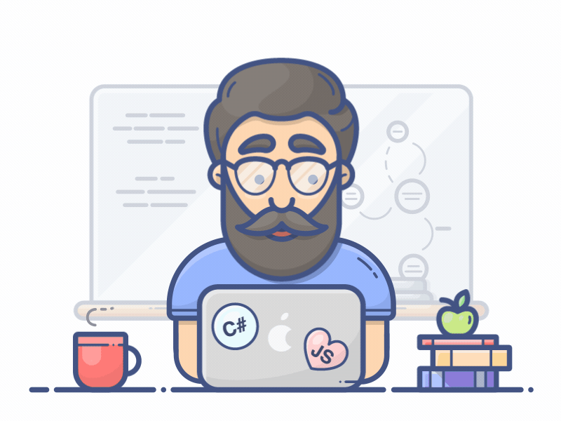

# Hi, I'm Aditya Fadni 👋

### Information Technology Student · Web Developer · Indonesia 🇮🇩

I enjoy building web applications, exploring new technologies,  
and turning ideas into things that actually work.

 

---

## 👨‍💻 About Me

- 🎓 Information Technology student
- 💻 Interested in **Web Development & Backend Development**
- 🌱 Currently exploring modern web technologies
- 🛠️ Enjoy building real-world projects and experimenting with new tools
- 🤝 Open to collaboration and interesting projects
- 📫 Reach me at **aditya.fadni@gmail.com**
- 🌐 Portfolio: **[adityafadni.is-a.dev](https://adityafadni.is-a.dev/)**

 

---

## 🛠️ Tech Stack

### Languages

 

### Frameworks & Technologies

 

### Database & Cloud

 

### Tools

---

## 📊 GitHub Statistics

 

---

## 🚀 Explore My Work

  

Building, learning, and improving — one commit at a time.

